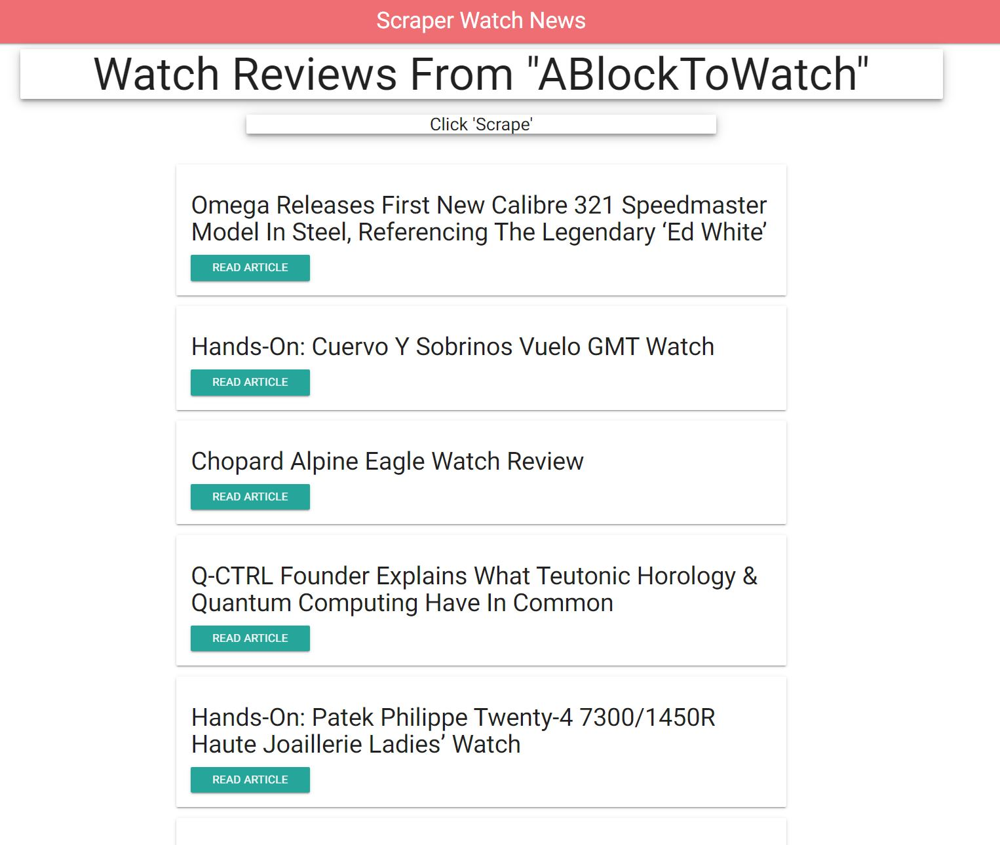

# All-the-News-That-s-Fit-to-Scrape

Welcome to All-the-News-That-s-Fit-to-Scrape! Here we have a web app that let the user Scrap into a website and find the latest news.
No need to write the articles. instead you can grab them and add them straight to your app by using an npm package called Cheerio.
In this app we are getting the latest news from the ABlogToWatch. 

App build with node, Express, Mongo, Mongoose, Cheerio, Axios, Handlebars.

